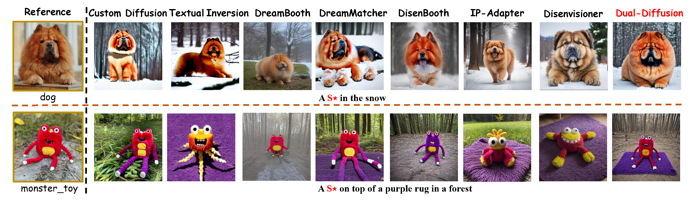

# Dual-Diffusion  

<div align="center">
  
</div>

<p align="center">
  <a href="https://github.com/your_org/dual-diffusion/actions">
    
  </a>
  <a href="https://pypi.org/project/dual-diffusion/">
    
  </a>
  
  
</p>

> **Subject–Driven · Personalized · Text-to-Image Generation**  
> Built on top of *Stable Diffusion 2-1* and *DreamBench.*

---

## ✨ Highlights

- **🔄 Dual Training Pipeline** – Combines *Subject Inversion* and *Prompt Editing* for richer personalization.
- **⚖️ Lightweight & Fast** – Fine-tune in **< 15 min** on a single 16 GB GPU.
- **📊 SOTA Quality** – Outperforms DreamBooth, LoRA, IP-Adapter, DisenBooth & more on DreamBench.
## Requirements

```
 pip install diffusers(0.23.1)
 pip install open_clip_torch
 pip install torchvision
 At least 1x16GB NVIDIA GPU
```
## Training

``` bash train.sh```

## Datasets
Download the [DreamBench Dataset] (https://github.com/google/dreambooth) and extract them to dataset/\
Download Pretrained Model Stable Diffusion 2-1.
